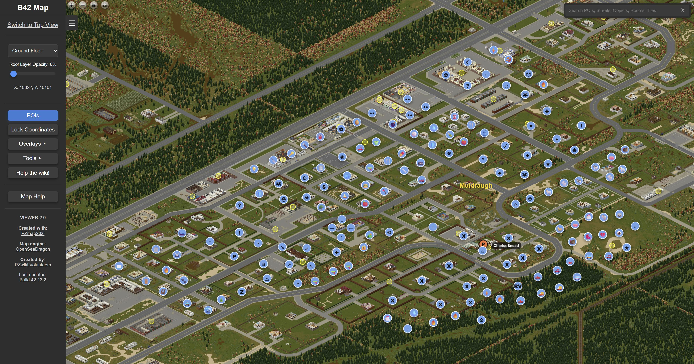

# PZMapSync

PZMapSync overlays your live Project Zomboid Build 42 position and map markers on [b42map.com](https://b42map.com/).

PZMapSync is an unofficial community project. It works with b42map.com and Project Zomboid data, but it is not affiliated with, endorsed by, or directly associated with b42map.com, The Indie Stone, or Project Zomboid.



It has three pieces:

- a Project Zomboid mod that writes `PZMapSync_pzmapsync.json`
- a small native messaging host that lets the browser extension read that file
- a Chromium/Edge extension that draws the player and marker overlay on b42map

## Install

### 1. Install the Project Zomboid mod

Copy:

```text
mod\PZMapSync
```

to your Zomboid local mods folder:

```text
C:\Users\<you>\Zomboid\mods\PZMapSync
```

Then start Project Zomboid, enable **PZMapSync** in the Mods menu, and add it to your save if you are loading an existing world. Once loaded in-game, the mod writes:

```text
C:\Users\<you>\Zomboid\Lua\PZMapSync_pzmapsync.json
```

### 2. Register the browser native host

From the repository root, run:

```powershell
powershell -ExecutionPolicy Bypass -File scripts\install-native-host.ps1
```

This registers `com.pzmapsync.host` for Chrome and Edge so the extension can read the Zomboid JSON file.

### 3. Load the extension

In Edge or Chrome:

1. Open `edge://extensions` or `chrome://extensions`.
2. Enable **Developer mode**.
3. Choose **Load unpacked**.
4. Select the `extension` folder from this repository.
5. Open [https://b42map.com/](https://b42map.com/).

If everything is connected, the overlay status should say something like:

```text
PZMapSync live: 1 player, 16 markers
```

## Use

- Player and marker pins update from your live Zomboid snapshot.
- Right-click the player pin and choose **Follow** to keep the map centered on that player.
- Right-click again and choose **Stop following** to disable follow mode.

## Troubleshooting

If the overlay is not live:

- Confirm `C:\Users\<you>\Zomboid\Lua\PZMapSync_pzmapsync.json` exists and is updating.
- Re-run `scripts\install-native-host.ps1`.
- Reload the unpacked extension from the browser extensions page.
- Reload `https://b42map.com/`.

To test the native host directly:

```powershell
C:\Users\<you>\.cache\codex-runtimes\codex-primary-runtime\dependencies\node\bin\node.exe scripts\test-native-host.js
```

Developer notes, mock overlay workflows, and verification helpers live in [docs/development.md](docs/development.md).

## License

PZMapSync is released under the [MIT License](LICENSE).
